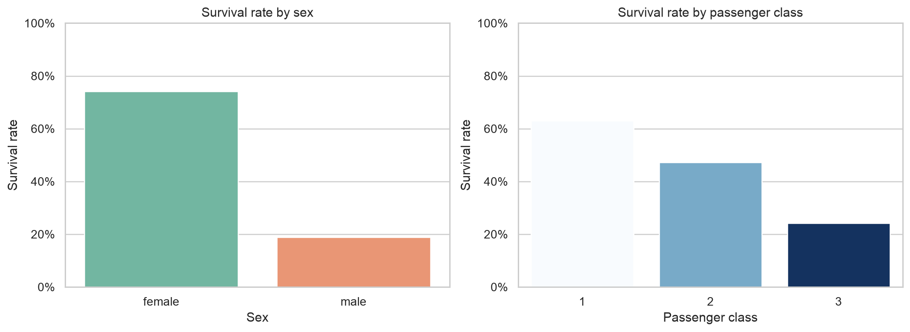
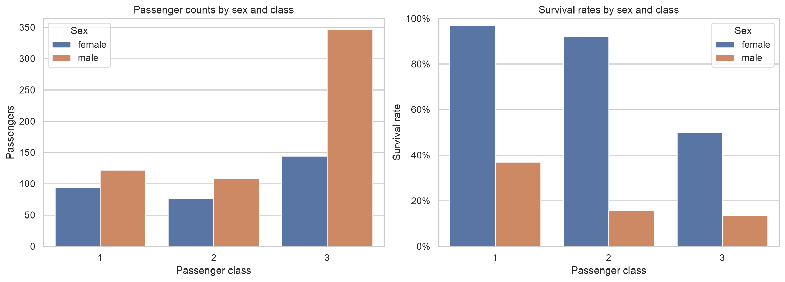
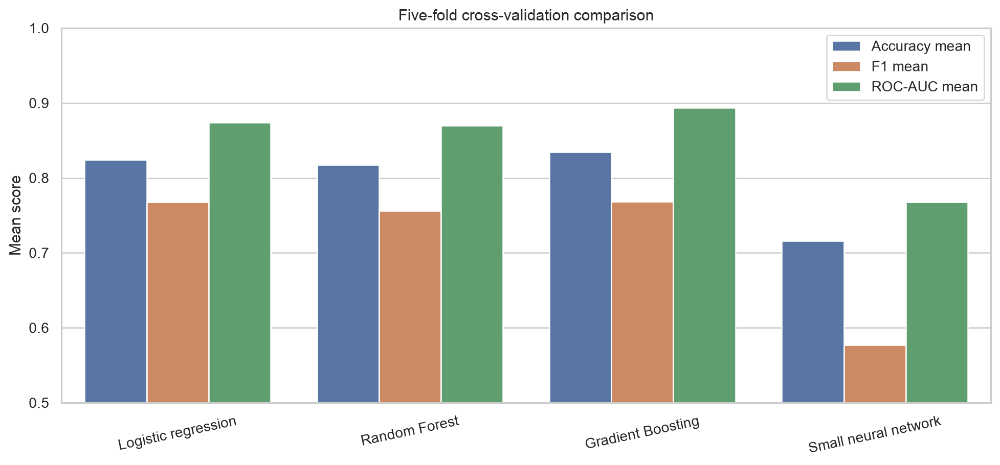
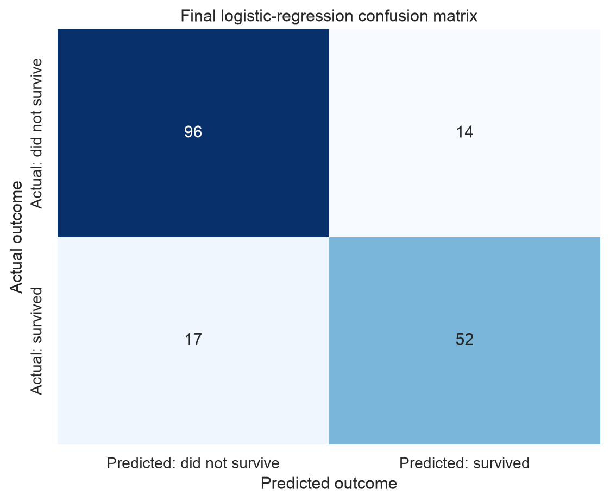
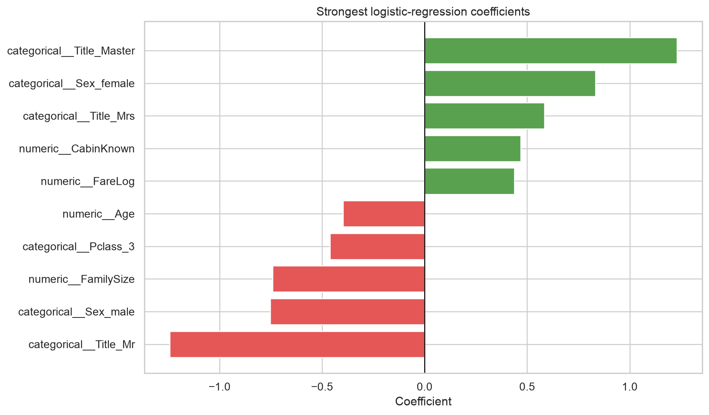

# Assignment 1 — Part 1: Titanic Survival Analysis

This project uses the Kaggle Titanic dataset to explore passenger survival and build a small, interpretable classification model. The work follows the **CRISP-DM** process and was developed through an AI-assisted, step-by-step data-science workflow.

## Project question

Which passenger characteristics were associated with survival on the Titanic, and how accurately can a small, interpretable model predict survival?

## Submission links

- **Executed Jupyter notebook:** [`titanic_analysis.ipynb`](titanic_analysis.ipynb)
- **Medium article:** [Read on Medium](https://medium.com/@byeonggwan.cho/predicting-titanic-survival-with-crisp-dm-5a757e4df9d5)
- **Exported ChatGPT transcript/PDF:** [`Assignment-1_GPT_Script.pdf`](Assignment-1_GPT_Script.pdf)
- **YouTube walkthrough:** [Watch on YouTube](https://youtu.be/pWoM2SwEzJQ)

## Dataset

The project uses the [Kaggle Titanic: Machine Learning from Disaster](https://www.kaggle.com/competitions/titanic) dataset.

- `train.csv` contains 891 passengers and includes the `Survived` target.
- `test.csv` and `gender_submission.csv` are retained as original Kaggle artifacts but are not used for this validation-based analysis.
- The original CSV files are not overwritten by the notebook.

## CRISP-DM workflow

1. **Business Understanding** — Defined a reasonable survival-prediction question for a small tabular dataset.
2. **Data Understanding** — Inspected columns, data types, missing values, duplicates, and survival patterns.
3. **Data Preparation** — Created a stratified split, handled missing values, engineered features, selected final columns, encoded categories, and scaled numeric inputs without data leakage.
4. **Modeling** — Compared a majority-class baseline, logistic regression, Random Forest, Gradient Boosting, and a small neural network.
5. **Evaluation** — Used five-fold cross-validation and one held-out validation set, then selected logistic regression as the final model.
6. **Deployment and Communication** — Consolidated the complete analysis into a reproducible notebook and saved its charts and tables for reporting.

## Exploratory data analysis

The original dataset contains 891 rows and 12 columns. There are no duplicate rows. The main missing-value problems are:

| Column | Missing values | Percentage |
|---|---:|---:|
| Cabin | 687 | 77.1% |
| Age | 177 | 19.9% |
| Embarked | 2 | 0.2% |

Of the 891 passengers, 342 survived and 549 did not survive, giving an overall survival rate of 38.4%.

Important descriptive findings included:

- Women had a substantially higher observed survival rate than men.
- First-class passengers had higher survival rates than second- and third-class passengers.
- Fare was strongly right-skewed, so `log1p(Fare)` was used.
- Cabin availability was related to both survival and passenger class, so it was retained only as a `CabinKnown` indicator.
- Family-count variables showed nonlinear patterns, motivating `FamilySize` and `IsAlone`.
- Sex and passenger class together revealed especially large differences between passenger groups.





## Data preparation

The target (`Survived`) and identifier (`PassengerId`) were separated before modeling. The remaining data were split into 80% training and 20% validation partitions using stratification and `random_state=42`.

| Split | Rows | Survival rate |
|---|---:|---:|
| Training | 712 | 38.34% |
| Validation | 179 | 38.55% |

All learned preparation rules were fitted on training data only and applied unchanged to validation. During cross-validation, preparation was learned separately inside each fold.

### Missing-value decisions

- `Age`: training median, 28.5
- `Embarked`: training mode, `S`
- `Fare`: training-median fallback, 14.4542
- `Cabin`: values were not filled or guessed; the binary `CabinKnown` feature was created instead

### Feature decisions

- Created `FareLog`, `CabinKnown`, `FamilySize`, `IsAlone`, and `Title`.
- Kept `FareLog` and removed raw `Fare`.
- Removed `SibSp` and `Parch` after creating the family features.
- Extracted `Title`, then removed raw `Name`.
- Removed high-cardinality `Ticket` and raw `Cabin`.
- Treated `Pclass` as categorical rather than assuming equal numeric spacing between classes.

The final feature set was:

`Pclass`, `Sex`, `Age`, `FareLog`, `Embarked`, `CabinKnown`, `FamilySize`, `IsAlone`, and `Title`.

Categorical features were one-hot encoded and numeric features were standardized. The preprocessing steps were kept inside scikit-learn pipelines to avoid data leakage.

## Model comparison

The four main models were compared using five-fold stratified cross-validation on the training partition. No hyperparameter tuning was performed.

| Model | Accuracy | F1 | ROC-AUC |
|---|---:|---:|---:|
| Logistic regression | 0.8244 ± 0.0207 | 0.7678 ± 0.0195 | 0.8743 ± 0.0153 |
| Random Forest | 0.8174 ± 0.0098 | 0.7558 ± 0.0195 | 0.8696 ± 0.0163 |
| Gradient Boosting | **0.8343 ± 0.0156** | **0.7687 ± 0.0280** | **0.8940 ± 0.0208** |
| Small neural network | 0.7162 ± 0.0701 | 0.5767 ± 0.1019 | 0.7678 ± 0.0963 |

Gradient Boosting had the strongest cross-validation averages, while the small neural network was unstable for this small dataset. Gradient Boosting was therefore evaluated provisionally on the held-out validation set before the final decision.



## Final model evaluation

**Logistic regression was selected as the final model.** Although Gradient Boosting led the cross-validation averages, logistic regression performed better on every held-out validation metric and remained substantially easier to interpret.

| Model | Accuracy | Precision | Recall | F1 | ROC-AUC |
|---|---:|---:|---:|---:|---:|
| Majority-class baseline | 0.6145 | 0.0000 | 0.0000 | 0.0000 | 0.5000 |
| **Logistic regression** | **0.8268** | **0.7879** | **0.7536** | **0.7704** | **0.8653** |
| Gradient Boosting | 0.8101 | 0.7869 | 0.6957 | 0.7385 | 0.8409 |

The final logistic-regression confusion matrix contained:

- 96 true negatives
- 52 true positives
- 14 false positives
- 17 false negatives



## Model interpretation

The strongest features pushing predictions toward survival included titles such as `Master` and `Mrs`, female sex, cabin information being recorded, and higher logged fare. Features pushing predictions toward non-survival included the title `Mr`, male sex, larger family size, third class, and higher age.

These coefficients describe associations learned from this dataset. They should not be interpreted as causal effects.



## Errors and limitations

The final model made 31 validation errors: 14 false positives and 17 false negatives. Broad patterns involving sex, class, age, family structure, and title did not correctly describe every individual passenger.

Important limitations include:

- The dataset is small, with only 712 training rows and 179 validation rows.
- Final model selection partly depends on a single held-out validation split.
- The validation set should not now be reused for tuning.
- Median imputation and `CabinKnown` simplify incomplete information.
- Feature engineering was intentionally limited, and no hyperparameter tuning was performed.
- The data are historical and observational. Their relationships are not causal rules or appropriate decision criteria for modern settings.

## Plain-language conclusion

Titanic survival was strongly associated with sex and passenger class, while fare, family structure, age, title, and cabin-record availability added useful context. The final logistic-regression model correctly classified approximately 83% of the held-out passengers. It was selected because it combined strong validation performance, stable results, and clear interpretation for a small educational dataset.

## Repository structure

```text
titanic-assignment-1/
├── README.md
├── titanic_analysis.ipynb
├── requirements.txt
├── data/
│   ├── train.csv
│   ├── test.csv
│   └── gender_submission.csv
└── titanic_notebook_outputs/
    ├── charts/
    └── tables/
```

The local `.venv` directory is intentionally excluded from the project artifacts because it can be recreated from `requirements.txt`.

## Run the project locally

Python 3.12 was used for the final local run.

```bash
python3.12 -m venv .venv
source .venv/bin/activate
python -m pip install --upgrade pip
python -m pip install -r requirements.txt
```

Open `titanic_analysis.ipynb` in VS Code, select `.venv/bin/python` as the Jupyter kernel, and run all cells. The notebook reads `data/train.csv` and recreates the charts and tables under `titanic_notebook_outputs/`.

## Tools

- Python
- pandas and NumPy
- Matplotlib and seaborn
- scikit-learn
- Jupyter and VS Code
- ChatGPT/Codex for guided, agentic coding and documentation support

## AI assistance

The primary project conversation used ChatGPT with the GPT-5.6 Sol model at medium reasoning. ChatGPT/Codex was used to plan the workflow, generate and review code, explain results, and prepare documentation. The final notebook was executed and verified locally in VS Code.

A separate support conversation was used for clarification and project organization. The primary implementation transcript is included in this repository.

## Reproducibility note

The project uses `random_state=42` for the train-validation split, cross-validation shuffling, and supported model random states. All reported results were reproduced by running the final notebook from top to bottom in a Python 3.12 virtual environment with scikit-learn 1.9.0.

## Project links

The complete notebook, charts, and reproducibility instructions are available in my [GitHub repository](https://github.com/atomicbunnies/assignment-1.git).

A complete video walkthrough is available on [YouTube](https://youtu.be/pWoM2SwEzJQ).

---

# Assignment 1 — Part 2: AI-Assisted Data Science Replication

This section documents the second part of the assignment, where I replicated data-science experiments from the instructor's example repository using an AI-assisted coding workflow.

Unlike Part 1, which focused on a complete Titanic survival-analysis workflow, Part 2 focused on using an AI coding assistant to explore, understand, and reproduce data-science examples in an existing project.

## Objective

The goal of Part 2 was to replicate data-science experiments provided by the instructor while using an AI coding assistant to help understand the existing project, execute the experiments, and work with the generated code.

The instructor's reference repository is:

- [Data Science Examples](https://github.com/dlmastery/data_science_examples)

The assignment encouraged the use of a favorite coding assistant and allowed students to go beyond the exact examples provided.

## AI Coding Assistant

For Part 2, I used **Cursor** as the AI-assisted coding environment.

Cursor was used to interact with the existing project, understand the provided examples, generate or modify code when needed, and assist with running the data-science experiments.

The workflow was intentionally lightweight and focused on demonstrating how an AI coding assistant can be used to work with an existing data-science codebase.

## Workflow

The Part 2 workflow was approximately:

1. Started from the instructor-provided data-science examples.
2. Opened the project in Cursor.
3. Used natural-language instructions to ask the AI coding assistant to help understand and reproduce the experiments.
4. Reviewed the generated or modified code.
5. Ran the experiments and checked the resulting outputs.
6. Kept the resulting project artifacts in the GitHub repository.
7. Recorded a walkthrough showing the AI-assisted workflow and the resulting project.

This demonstrates a different use of AI-assisted coding from Part 1: instead of building the analysis primarily from scratch, the AI assistant was used to work with and reproduce an existing collection of data-science examples.

## Prompts and AI-Assisted Development

The Part 2 implementation was performed through natural-language instructions in Cursor.

The prompts were intentionally concise and task-oriented. Rather than manually writing every step of the implementation, I used Cursor to help navigate the existing project, understand the experiments, and make the necessary code changes.

This was also an opportunity to explore how much of a data-science workflow can be reproduced through an AI coding assistant while still reviewing and executing the resulting code locally.

## Results and Artifacts

The Part 2 project files and generated artifacts are included in this GitHub repository.

The repository contains the files needed to review the work performed for Part 2 alongside the original Part 1 Titanic analysis.

## Part 2 Walkthrough

The Part 2 process and results are demonstrated in the following video:

**YouTube:** [Watch the Part 2 walkthrough](https://youtu.be/MPUYjToraik)

The video demonstrates the AI-assisted coding workflow in Cursor and walks through the resulting data-science project.

## Part 2 Takeaway

Part 2 provided an opportunity to use an AI coding assistant in a different way from the Titanic project.

The main takeaway was that tools such as Cursor can be useful not only for generating new code, but also for understanding an existing codebase, reproducing experiments, modifying examples, and iterating on data-science workflows through natural-language instructions.

Together, Part 1 and Part 2 demonstrate two complementary AI-assisted workflows:

- **Part 1:** Building and documenting a complete data-science analysis with AI assistance.
- **Part 2:** Using an AI coding assistant to explore and reproduce experiments from an existing data-science project.

